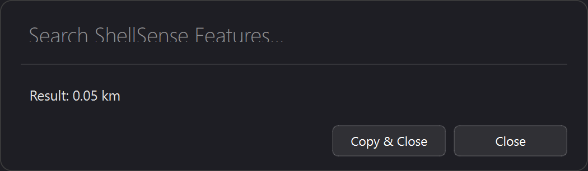

# 🚀 ShellSense — The Keyboard-First Utility Command Palette

<p align="center">
  
  
  
  
</p>

---

**ShellSense** is a premium, keyboard-first command palette built for power users. Similar to Spotlight (macOS) or Raycast, it brings natural language commands, unit conversions, timezone translation, quick file snippets, and background timers right to your fingertips via a **sleek, frosted-glass interface**.

<p align="center">
  
</p>

---

## ✨ Features & Capabilities

### 🧮 1. Instant Calculations & Unit Conversions
* **The Problem:** Opening calculator apps or googling "10 miles to km" breaks your focus.
* **The Solution:** Evaluate expression instantly from the bar.
  * *Try:* `15% of 80`, `sqrt(144)`, or `10 miles to km`

### 🌐 2. Timezone Translation
* **The Problem:** Converting schedule invites between zones is tedious.
* **The Solution:** Quick zone matching.
  * *Try:* `10:30 am est to ist`

### 💱 3. Currency Exchange
* **The Problem:** Loading currency conversion websites is slow and ad-heavy.
* **The Solution:** Fast, local exchange rate conversions.
  * *Try:* `100 usd to eur`

### 📂 4. File Finder & Downloads Hook
* **The Problem:** Digging through your downloads folder to open or copy your latest file.
* **The Solution:** Access your most recent downloads instantly.
  * *Try:* `open last download` or `copy last download`

### ⏱️ 5. Distraction-Free Alarms & Timers
* **The Problem:** Setting a timer on your phone distracts you.
* **The Solution:** Background timers triggering native Windows alerts.
  * *Try:* `timer 5 mins to check oven` or `stop timer`

### ⚙️ 6. System Cleanup & Tune-up
* **The Problem:** SSD bloat and slow startup.
* **The Solution:** Audit startup apps and clear cache paths.
  * *Try:* `show startup apps` or `clean temp files`

---

## ⚡ Quick Start

1. **Install Dependencies:**
   ```bash
   pip install -r requirements.txt
   ```
2. **Run Application:**
   Double-click `run.bat` or run:
   ```bash
   pythonw -m shellsense.ui.interface
   ```
3. **Hotkeys:**
   - **`Ctrl + Shift + Space`**: Summon / Dismiss the palette
   - **`Escape`**: Clear result and close
   - **`Enter`**: Process command / Copy result & close (after rendering output)

---

## 📌 Start Menu & Taskbar Shortcuts (Windows)

To launch ShellSense instantly or keep it accessible, follow these simple setup steps:

### 1. Create the Desktop Shortcut
Run the included PowerShell script to create a optimized shortcut pointing to `pythonw.exe`:
```powershell
powershell -ExecutionPolicy Bypass -File .\create_shortcut.ps1
```
*This will create a `ShellSense` shortcut icon directly on your Desktop.*

### 2. Pin to Taskbar
1. Locate the **ShellSense** shortcut on your Desktop.
2. Right-click the shortcut and select **Pin to Taskbar** (or drag and drop it onto your Windows Taskbar).

### 3. Add to Start Menu Search & Programs
1. Press `Win + R` to open the Run dialog.
2. Type `shell:programs` and hit Enter. This opens the **Start Menu Programs** directory.
3. Move or Copy the `ShellSense` desktop shortcut into this folder.
4. *ShellSense is now indexable by Windows Search—just press the Windows key, type "ShellSense", and press Enter.*

### 4. Run Automatically at Startup
1. Press `Win + R` to open the Run dialog.
2. Type `shell:startup` and hit Enter. This opens the **Startup** folder.
3. Paste a copy of the `ShellSense` desktop shortcut into this folder.
4. *ShellSense will now start silently in the background whenever you boot Windows.*

---

## 📜 Version History & Progression

### 🛡️ Version 1 (v1) — Foundation
* **Core Functions:**
  * Basic command line generation and routing.
  * Launching programs and executing shell scripts silently.
  * Simple, flat keypress handlers for summoning the interface.
* **Brain Service:** Initial model `shellsense_v1.pkl` focused on basic command classification and matching.

### ⚡ Version 2 (v2) — Functional Utility Expansion
* **Core Upgrades:**
  * **Timezone Translator:** Integrated offline timezone offset translator (e.g., `est to ist`).
  * **Real-time Currency Exchange:** Integrated fast currency conversions (e.g., `usd to eur`).
  * **Downloads Finder:** Accessing or copying the latest file from the Downloads folder.
  * **File Shortcuts:** Opening custom files/folders or copying custom text snippets via shorthand bindings configured in `file_shortcuts.json`.
  * **Background Timers:** Setting native background timers that trigger native Windows OS alert dialogs.
  * **System Tuner:** Auditing and disabling startup applications and clearing temp files.
* **Brain Service:** Upgraded to `shellsense_v2.pkl` for increased classification confidence and broader parser intent classification.

### 🌟 Version 3 (v3) — Interactive UI & UX Polish (Current)
* **Core Upgrades:**
  * **Frosted-Glass Redesign:** Added dynamic sizing, glassmorphism transparency, and a clean minimalist styling.
  * **Interactive Unit Conversions:** Added comprehensive unit converters (length, speed, mass/weight, volume, temperature, pressure, area, power) with smart parsing logic.
  * **Dynamic Selection Panels:** Category inputs (like `length`, `mass/weight`, `timer`, etc.) now present visual inputs inside the palette instead of requiring pure command entry.
  * **Result Action Widget:** Persistent `Copy & Close` and `Close` buttons allow mouse-driven action on command output.
  * **Double-Enter & Escape Keyboard Flow:** Pressing Enter in the value field submits the conversion, focusing back to the search bar. Pressing Enter a second time copies the result and closes. Pressing Escape closes immediately without copying.
  * **Snooze Option:** Custom snooze timer settings directly in the alarm popup alert.
* **Brain Service:** High-confidence `shellsense_v3.pkl` model supporting categorization matching for interactive panels.